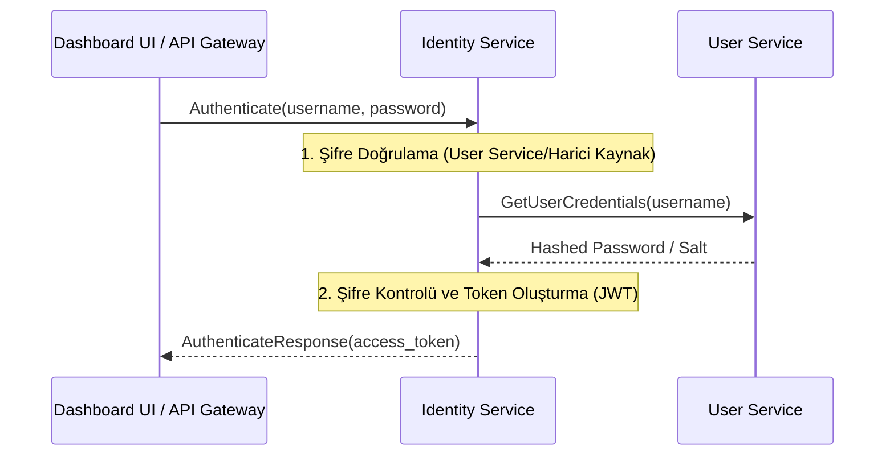
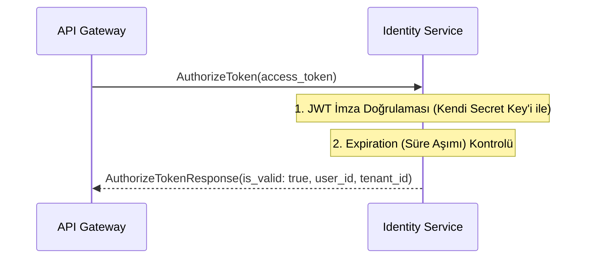

# 🆔 Sentiric Identity Service - Mantık ve Akış Mimarisi

**Stratejik Rol:** Kullanıcı Kimlik Doğrulama (AuthN) ve Yetkilendirme (AuthZ) rollerini üstlenir. `user-service`'i sadece veri deposu (CRUD) olarak bırakır. Bu servis, kimlik bilgileri karşılığında JWT (JSON Web Token) üretir ve bu tokenleri doğrular.

---

## 1. Temel Akış: Kimlik Doğrulama (Authenticate)

## 2. Temel Akış: Yetkilendirme (AuthorizeToken)

Agent veya API Gateway, gelen her isteğin geçerli bir JWT'ye sahip olup olmadığını kontrol etmek için bu servisi kullanır.

