# 🆔 Sentiric Identity Service - Mantık ve Akış Mimarisi

**Stratejik Rol:** Kullanıcı Kimlik Doğrulama (AuthN) ve Yetkilendirme (AuthZ) rollerini üstlenir. `user-service`'i sadece veri deposu (CRUD) olarak bırakır. Bu servis, kimlik bilgileri karşılığında JWT (JSON Web Token) üretir ve bu tokenleri doğrular.

---

## 1. Temel Akış: Kimlik Doğrulama (Authenticate)

```mermaid
sequenceDiagram
    participant Client as Dashboard UI / API Gateway
    participant ID as Identity Service
    participant USER as User Service
    
    Client->>ID: Authenticate(username, password)
    
    Note over ID: 1. Şifre Doğrulama (User Service/Harici Kaynak)
    ID->>USER: GetUserCredentials(username)
    USER-->>ID: Hashed Password / Salt
    
    Note over ID: 2. Şifre Kontrolü ve Token Oluşturma (JWT)
    
    ID-->>Client: AuthenticateResponse(access_token)
```

## 2. Temel Akış: Yetkilendirme (AuthorizeToken)

Agent veya API Gateway, gelen her isteğin geçerli bir JWT'ye sahip olup olmadığını kontrol etmek için bu servisi kullanır.

```mermaid
sequenceDiagram
    participant API as API Gateway
    participant ID as Identity Service
    
    API->>ID: AuthorizeToken(access_token)
    
    Note over ID: 1. JWT İmza Doğrulaması (Kendi Secret Key'i ile)
    Note over ID: 2. Expiration (Süre Aşımı) Kontrolü
    
    ID-->>API: AuthorizeTokenResponse(is_valid: true, user_id, tenant_id)
```

